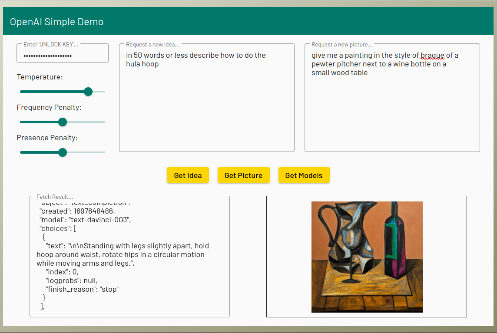

# Simple OpenAI Playground

## An Angular / Material app to test interfacing to OpenAI's API.



**AI... Whatever you may thnk of AI, it is the latest buzz in tech. As professional developers we really need to have at least a cursory idea about what AI is. One way to expore this is to incorporate OpenAI's API into our code. We can then use it in our own apps. This is a great way to learn some of the possibilites of AI whithout having to write our own engines. It's pretty easy: open an API account, generate some API keys, start writing code. Learning to talk to OpenAI so as to get exactly the output you want is not simple - it involves learning how to tune your prompts, provide examples, choose the correct output model, and more...**

**This app is a simple gateway into exploring these ideas.**

**Usage:**

- clone the repo, then npm install
- ng serve aidemo --open

**This app is finalized for using my VPS server to obfuscate my API_KEY. The code for testing within an Angular app without having to setup a separate server is included, but commented out. You basically run the code your server would run locally:**

```
//-- include the api...
//
import OpenAI from 'openai';

//-- create an API object to interact with OpenAI...`
//
const ai = new OpenAI({apiKey: 'my_openai_api_key', dangerouslyAllowBrowser: true});

//-- now you can make an API call: something like this for an image...
//
this.imagePrompt = 'give me a painting in the style of braque of a pewter pitcher next to a wine bottle on a small wood table'

const requestBody = {
  prompt: this.imagePrompt,   // the prompt describing the image you want
  count: this.count,          // how many images to generate {default: 1}
  size: this.imageSize,       // one of '256x256' or '512x512' or '1024x1024'
  format: this.imageFormat    // 'url' or 'base64_json`
}

const imageObj = await ai.images.generate(requestBody).then(
  data => {
    this.currentResult = JSON.stringify(data, null, 2);
  },
  err => {
    this.currentResult = JSON.stringify(err.error, null, 2);
 }
);
const imageUrl = imageObj.data[0].url;
```

**It is unsafe to instantiate the api in your app for production - your OPENAI_API_KEY is exposed to the world and sooner or later you may find all your tokens are vanishing... To fix this you should move your credentials and API calls to your server.**

**I am using an express https server and I created an openai endpoint: https://mydomain/openai. I only accept a post to this endpoint and the caller must include a 'secret' key to make it difficult for anyone to just hit my endpoint and use my tokens. I include an env.js file:**

```
const process = {
  env: {
    OPENAI_UNLOCK_KEY: 'my-openai-unlock-key', // some secret key to protect the endpoint...
    OPENAI_API_KEY: 'my-openai-api-key'        // one of your generated openai api keys...
  }
}
module.exports = process;
```

**And my endpoint starts like this:**

```
const process = require('./env');
const OpenAI  = require('openai');


      //
      // blah
      // blah
      //


app.post('/openai', async (req, res) => {
  let response, ai, dataObj, aiStatus = 200;
  
  if (req.body.key === process.env.OPENAI_UNLOCK_KEY) {
    switch (req.body.method) {
      case 'getIdea':
        if (req.body.prompt != '') {
          ai = new OpenAI({apiKey: process.env.OPENAI_API_KEY});
          dataObj = {
            prompt: req.body.prompt,
            model: req.body.model || 'text-davinci-003',
            n: req.body.count || 1,
            temperature: req.body.temperature || 1.0,
            frequency_penalty: req.body.frequency_penalty || 0.0,
            presence_penalty: req.body.presence_penalty || 0.0,
            max_tokens: req.body.max_tokens || 16
          }
          await ai.completions.create(dataObj).then(
            data => {
               response = data;
            },
             err => {
               aiStatus = 405;
               response = err;
             }
          );
        } else {
           aiStatus = 405;
           response = {error: 'ERROR - no idea request prompt...'};
        }
        break;

      case 'getImage':
        if (req.body.prompt != '') {
          ai = new OpenAI({apiKey: process.env.OPENAI_API_KEY});
          dataObj = {
            prompt: req.body.prompt,
            n: req.body.count || 1,
            size: req.body.size || '256x256',
            response_format: req.body.format || 'url'
          }
                
          await ai.images.generate(dataObj).then(
            data => {
               response = data;
            },
            err => {
              aiStatus = 405;
              response = err;
            }
          );
        } else {
          aiStatus = 405;
          response = {error: 'ERROR - no image request prompt...'};
        }
        break;

      //
      // blah
      // blah
      //

      default:
        aiStatus = 405;
        response = {error: 'No METHOD specified...'}
        break;
    }
  } else {
    aiStatus = 401;
    response = {error: 'You are not authorized...'}
  }
      
  res
    .setHeader('Content-Type', 'application/json')
    .status(aiStatus)
    .send(response);
});
```
**This creates a fairly large function, but the logic seems clear to me and it works. There are probably better ways to do this or maybe refactor the API calls into a separate file. Let me know if you have a better way or a different way of protecting your API_KEY.**

**This demo barely scratches the surface of OpenAI. Head over to their site for full API docs and tutorials:&nbsp;&nbsp;&nbsp;&nbsp;&nbsp;[Open AI](https://openai.com)**
